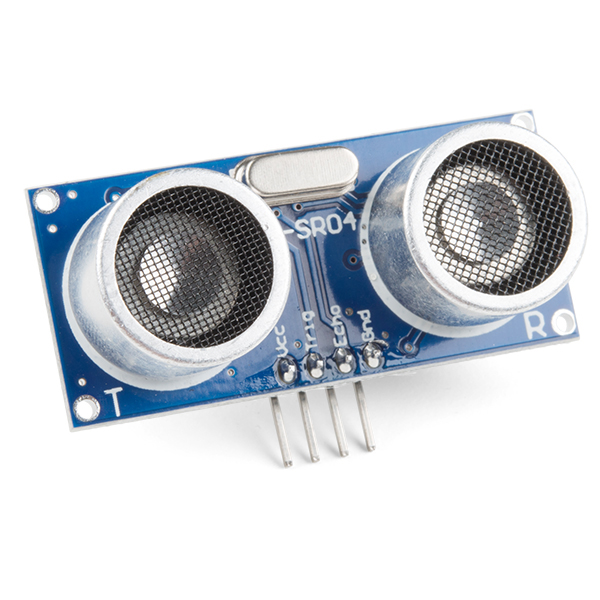

#### Created by Vince Ly and Christian Santiago

---

## Project Overview

Experience an innovative wake-up solution designed to ensure you start your day with a splash. This autonomous alarm clock utilizes advanced sensors and a pressurized water system to locate sleepers and deliver a targeted wake-up call.

## System Overview

Our unique system combines state-of-the-art ultrasonic sensors and a pressurized water mechanism to locate and wake you effectively. 

## Detailed Component Breakdown

### mBed LPC1768 (Controller)
Serves as the brain of our system, executing the software to control other components through its I/O ports. [More info](https://os.mbed.com/platforms/mbed-LPC1768/).

### HiLetGo LM317 Voltage Regulators
These maintain stable voltage levels for the system, ensuring consistent performance and protecting the circuitry. [More info](https://www.amazon.com/gp/product/B07VJDPZ2L/ref=ppx_yo_dt_b_search_asin_title?ie=UTF8&psc=1).

### Ultrasonic Distance Sensor HC-SR04
Detects the distance to the nearest object, critical in mapping the sleeper's position for targeted water delivery. [More info](https://www.sparkfun.com/products/15569).

### DEVMO MG995 Continuous Servo Motors
Provide the mechanical actuation needed to adjust the water nozzle's aim with precision. [More info](https://www.amazon.com/gp/product/B07X3S6FM2/ref=ppx_yo_dt_b_search_asin_title?ie=UTF8&psc=1).

### GikFun Mini DC 6V-12V Water Diaphragm Pump
Pumps the water through the system, enabling the ejection mechanism to work effectively. [More info](https://www.amazon.com/gp/product/B0744FWNFR/ref=ppx_yo_dt_b_search_asin_title?ie=UTF8&psc=1).

### JBTek 4 Channel DC 5V Relay Module
Allows for controlling high power devices, such as the water pump, with low voltage signals from the controller. [More info](https://www.amazon.com/gp/product/B00KTEN3TM/ref=ppx_yo_dt_b_search_asin_title?ie=UTF8&psc=1).

### SPST Momentary Pushbutton Switches
Used for user input, allowing for manual control over alarm settings. [More info](https://os.mbed.com/users/4180_1/notebook/pushbuttons/).

### uLCD-144-G2 LCD Screen
Displays the system's status and provides an interface for user interaction. [More info](https://os.mbed.com/users/4180_1/notebook/ulcd-144-g2-128-by-128-color-lcd/).

[Watch our project demo](https://www.youtube.com/watch?v=fC7QabEXuDo).

## Implementation

Step-by-step details on how we brought this project to life, including coding practices, circuit design, and assembly instructions.

##  Step 1: Framework
We had spare 6mm acrylic on hand that can be acquired through local hardware stores such as Ace and Home Depot, with a large piece we were able to make the base, roof, and front panel of the alarm clock using clear cast acrylic and a few U-bolts.

##  Step 2: Electronics
From there we mounted the voltage reduction circuit to power the entire project externally which caused a few issues when wanting to use the relay. We got weird behavior where if we did not power the LPC1768 with the 5V USB supply the entired mBed would freeze up and not post our initial GUI for the display. We decided to just use a 5V LM317 to power the peripherals of the LCD and Ultrasonic and also made a 6V LM317 to supply the relay board, servos, and diaphram pump mentioned earlier.

The LCD was mounted using velcro tape in order to troubleshoot more readily around the frame. Along with the pushbuttons being placed on the same panel. These pushbuttons use the mBed's 3.3 volt output to configure logic active high which was set internally in the program.
Following the schematic the servos, ultrasonic, and LCD can be wired using appropriate extensions whenever needed.

##  Step 3: Linear Rail System
For moving in the X and Y axis direction we decided to model and 3D print a linear rail system using our own carriage design. This deisgn utilizes two servos that would mount directly to the carriage and allow the utlrasonic sensor to move freely along a grid that will be configured within the software.

## Conclusion and Future Work

We believe our system revolutionizes the morning routine. With potential expansions and user feedback, the possibilities are endless.

For a full list of components, please refer to the [Parts List](Parts_List.pdf).

---

Feel free to fork, star, or contribute to our project. Let's change the way we wake up!

